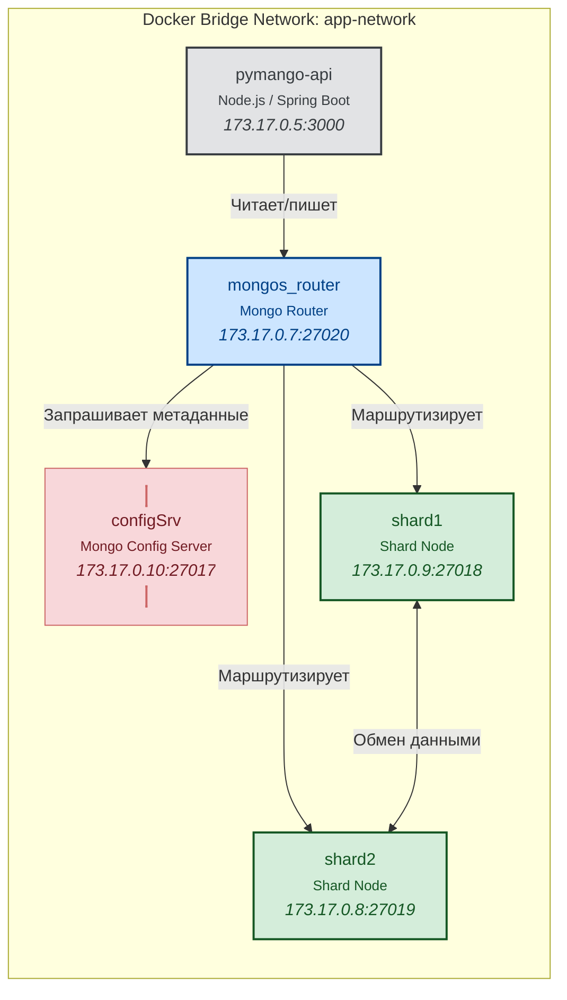
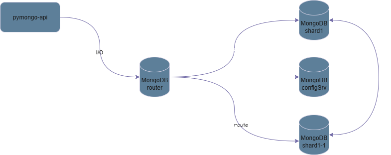

# Контекст

Адаптация системы хранения «Мобильный мир» к динамическим, нерегулярным и предсказуемый скачкам трафика.
# Решение

Декомпозиция базы на шарды. Key-based распределение данных по шардам через MongoDb Config Server

**Основные сервисы**

| Сервис                 | Роль                                                                                  |
| ---------------------- | ------------------------------------------------------------------------------------- |
| **configSrv**          | Узел mongoDB, Хранит **метаданные о распределении данных**                            |
| **shard1**, **shard2** | Шарды mongoDB, Хранят реальные бизнес данные                                          |
| **mongos_router**      | Роутер mongoDB, принимает запросы → спрашивает `configSrv` → направляет в нужный шард |
| **pymango-api**        | backend-api                                                                           |

### Схема взаимодействия сервисов

shema

# Последствия

* кратное снижение нагрузки за счет распределения данных по на несколько шардов
* отсутствие консистентности в случае расщепления системы хранения на изолированные сегменты 
* издержки на поддержание мультиконтейнерной системы хранения