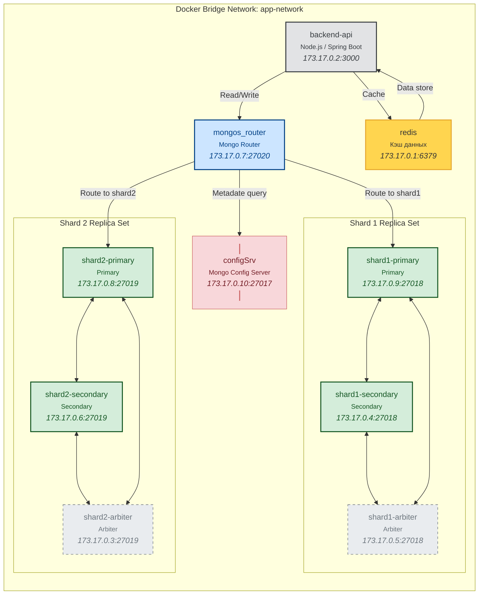
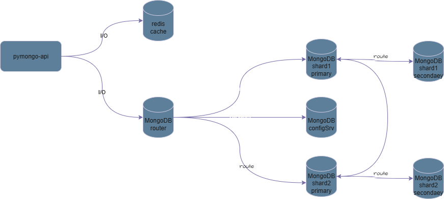
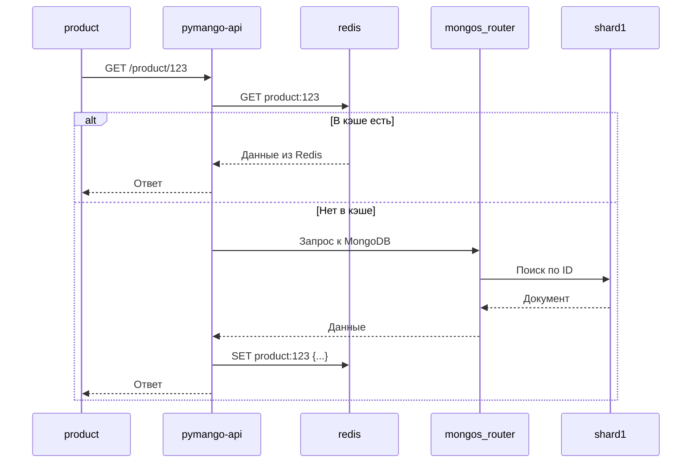
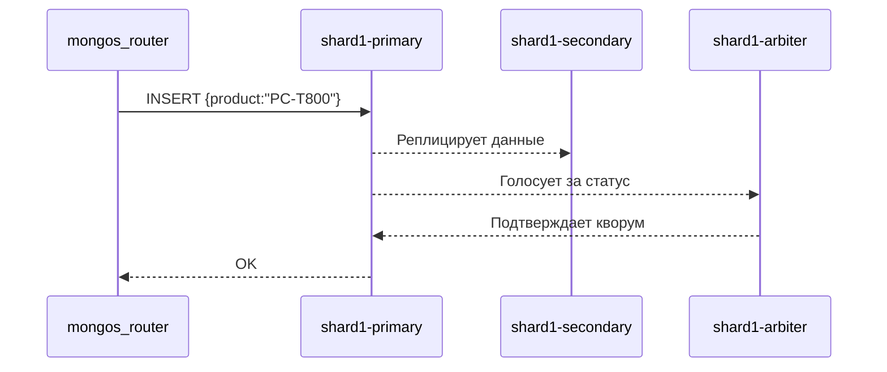

# Контекст

Адаптация системы хранения «Мобильный мир» к динамическим, нерегулярным и предсказуемый скачкам трафика.
# Решение

Внедрение внешнего L2 кэша

**Основные сервисы**

| Сервис              | Роль                                                                                                         |
| ------------------- | ------------------------------------------------------------------------------------------------------------ |
| **configSrv**       | Узел mongoDB, Хранит метаданные о распределении данных                                                       |
| **mongos_router**   | Роутер mongoDB, принимает запросы → спрашивает `configSrv` → направляет в нужный шард                        |
| **pymango-api**     | backend-api                                                                                                  |
| **Replica Set**     | чтобы данные дублировались внутри региона и система не падала при сбое одного узла.                          |
| **Primary-shard**   | принимает запиcm                                                                                             |
| **Secondary-shard** | получает копию от primary                                                                                    |
| **Arbiter**         | голосует при выборе нового Primary (если старый упал), но не хранит данные. Дает гарантию нечетного кворума. |
| **redis**           | служба L2-кэша                                                                                               |

### Схема сервисов

---
### схема сервисов drawio
схема

---

### Схема последовательности взаимодействия сервисов

---

### Схема последовательности репликации

# Последствия

* кратное снижение нагрузки на систему хранения
* риск того, что клиент получит устаревшие данные.