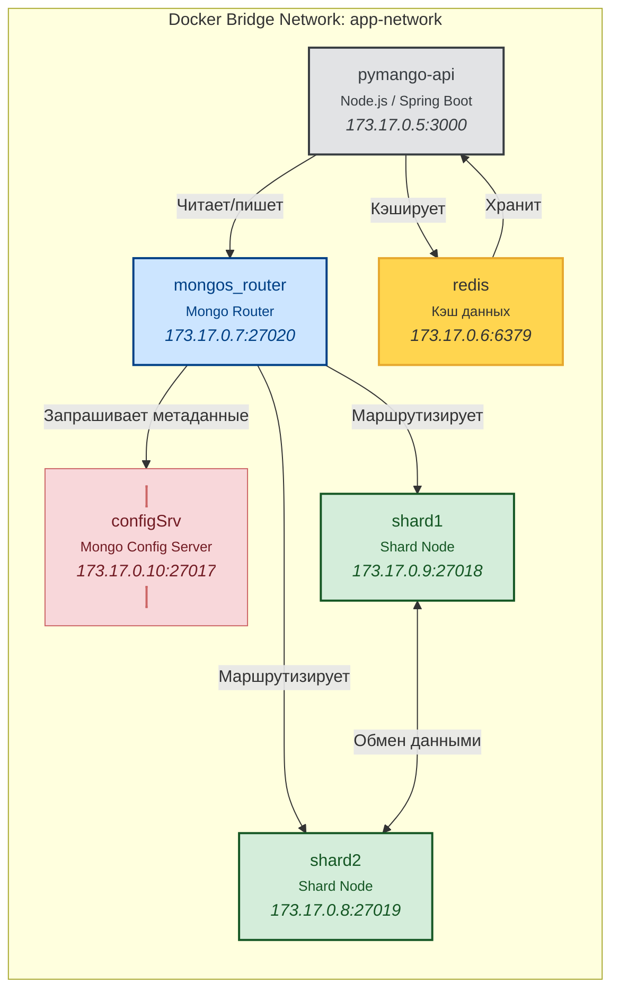
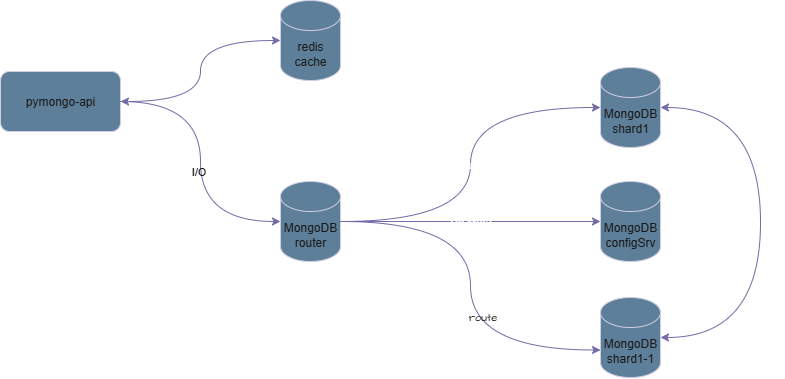
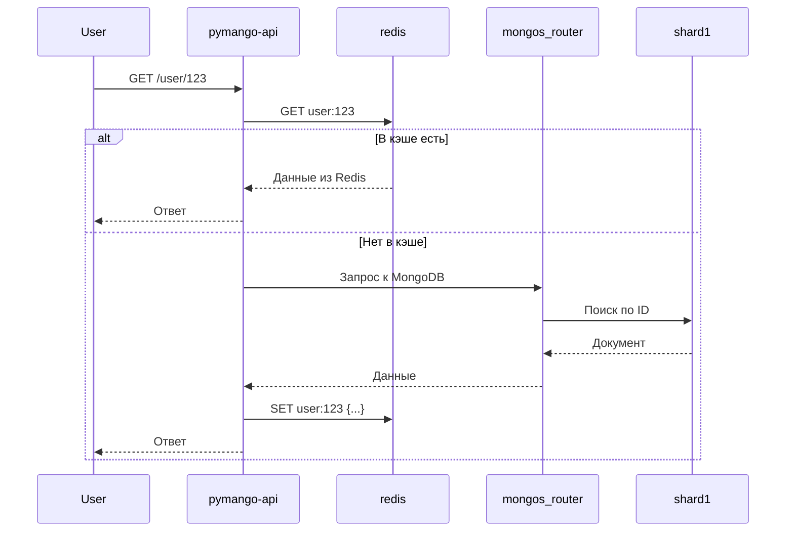

# Архитектура хранения данных онлайн-магазина «Мобильный мир»

## TO-BE

Проект мульти контейнерного приложения онлайн-магазина «Мобильный мир»
### Основные сервисы

| Сервис                 | Роль                                                                                  |
| ---------------------- | ------------------------------------------------------------------------------------- |
| **configSrv**          | Узел mongoDB, Хранит **метаданные о распределении данных**                            |
| **shard1**, **shard2** | Шарды mongoDB, Хранят реальные бизнес данные                                          |
| **mongos_router**      | Роутер mongoDB, принимает запросы → спрашивает `configSrv` → направляет в нужный шард |
| redis                  | служба L2-кэша                                                                        |
| pymango-api            | backend-api                                                                           |

---

### Схема взаимодействия сервисов

#### Схема взаимодействия сервисов draw.io

---

### Схема последовательности взаимодействия сервисов

---

### Идеи оптимизации

1. Только один `configSrv` в compose проекте – единая точка отказа, риск. Рекомендуется использовать Replica Set из 3+ `configSrv`
2. Разделить сеть на внутреннюю и внешнею, добавить API Gateaway
