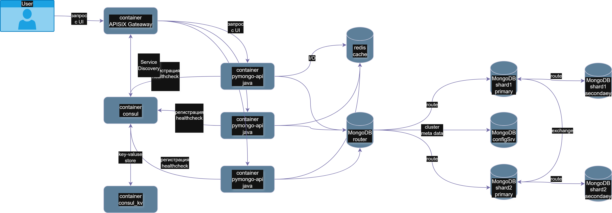
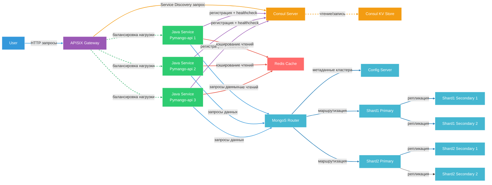
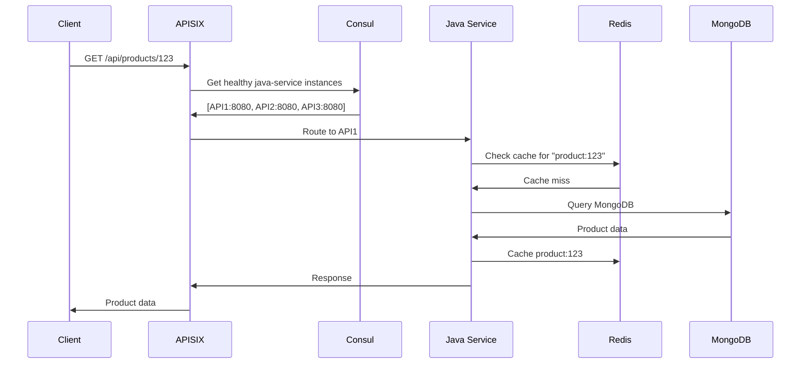

# Контекст

Адаптация системы хранения «Мобильный мир» к динамическим, нерегулярным и предсказуемый скачкам трафика.
# Решение

Для балансировки нагрузки повышения устойчивости системы вводим контейнеры (сервисы)
 - APISIX Gateaway
   - роли
     1. Авторизация запросов
     2. Балансировка нагрузки, маршрутизация
     3. Безопасность (WAF, CORS, Rate limiting)
   - Consul
     - роли
       1. Регистрация, поиск сервисов
       2. Мониторинг здоровья сервисов
       3. Хранилище конфигурации сервисов

### Схема сервисов

---
### Cхема сервисов drawio
схема

---

### Схема взаимодействия сервисов

---

### Последовательность взаимодействий сервисов

---

# Последствия

1. рост стоимость потребляемых ресурсов
2. устойчивость в экстремальным нагрузками, DDOS-атакам
3. кратный прирост стабильности сервиса
4. повышенные SLA гарантий по метрикам 
   1. время отклика (ms)
   2. пропускной способности приложения (RPS)
   3. времени доступности сервиса (%)
   4. задержка передачи данных (p <= %)  
