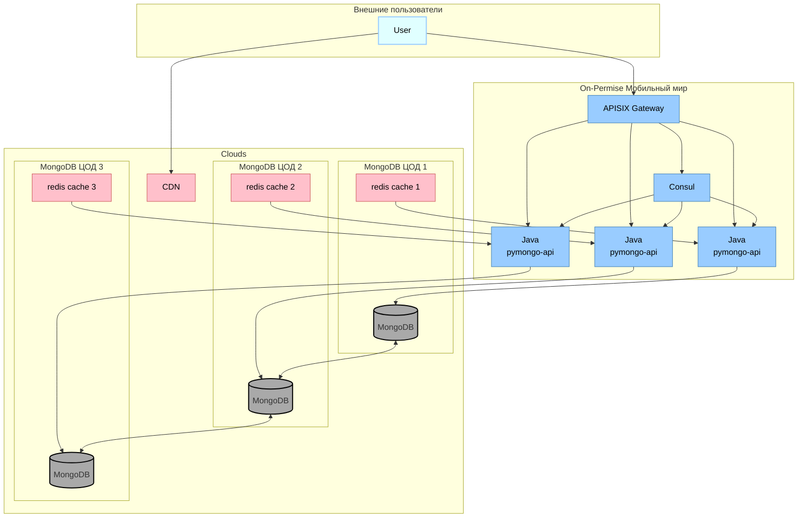
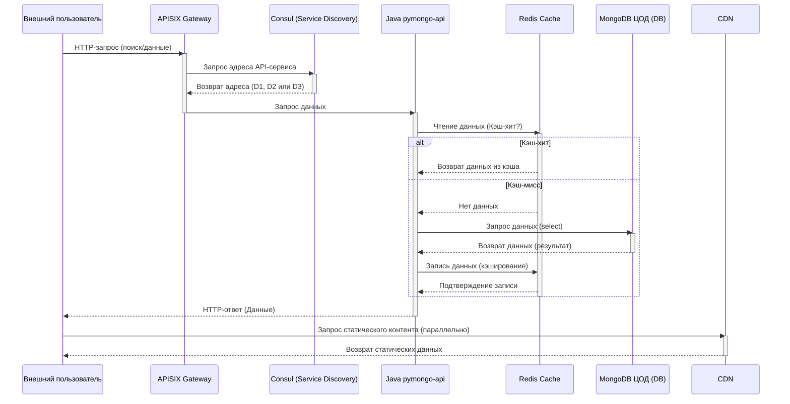

# Контекст

Обеспечения точек присутствия (PoP) в основных регионах ведения бизнеса для оптимальной гарантии качества и эффективности сервиса клиентам компании путем организации CDN.

# Решение

При организации Content Delivery Network принято решение внедрить метод разделения данных Anycast. 

На текущем этапе развития компании не достигнута достаточно равномерная дисперсия геокоординат клиентов по сетевым адресам. 

Целесообразно повысить производительность и устойчивость DNS путем наращивания числа точек присутствия с одинаковым адресом, что обеспечит оптимизацию роутинга для клиентов компании в зависимости от особенностей сетевой топологии каждого клиента. 

### Cхема сервисов drawio

### Схема сервисов

---
### Последовательность взаимодействий сервисов

# Последствия
1. геошардинг сервиса компании с учетом особенностей топологии роутинга клиента в каждом регионе присутствия
