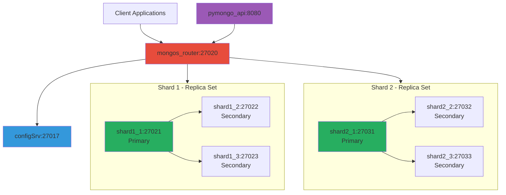

# Архитектура кластера

## Структура взаимодействий



## IP-адресация:
```
173.17.0.0/16 subnet:

Config Server:   173.17.0.10    (configSrv)

Shard 1:         
                - 173.17.0.21   (shard1_1)
                - 173.17.0.22   (shard1_2) 
                - 173.17.0.23   (shard1_3)

Shard 2:
                - 173.17.0.31   (shard2_1)
                - 173.17.0.32   (shard2_2)
                - 173.17.0.33   (shard2_3)

Router:         173.17.0.7      (mongos_router)
API:            173.17.0.50     (pymongo_api)
```


# Настройка кластера

### 1. Запустите приложение

```shell
docker compose up -d
```

### 2. Инициализируйте конфигурационный сервер

```shell
docker compose exec -T configSrv mongosh --port 27017 --quiet <<EOF
rs.initiate(
  {
    _id : "config_server",
       configsvr: true,
    members: [
      { _id : 0, host : "configSrv:27017" }
    ]
  }
);
EOF
```

### 3. Инициализируйте первый шард и его реплики

```shell
docker compose exec -T shard1_1 mongosh --port 27021 --quiet <<EOF
rs.initiate(
    {
      _id : "shard1",
      members: [
        { _id : 0, host : "shard1_1:27021" },
        { _id : 1, host : "shard1_2:27022" },
        { _id : 2, host : "shard1_3:27023" }
      ]
    }
);
EOF
```

### 4. Инициализируйте второй шард и его реплики

```shell
docker compose exec -T shard2_1 mongosh --port 27031 --quiet <<EOF
rs.initiate(
    {
      _id : "shard2",
      members: [       
        { _id : 1, host : "shard2_1:27031" },
        { _id : 2, host : "shard2_2:27032" },
        { _id : 3, host : "shard2_3:27033" }
      ]
    }
  );
EOF
```

### 5. Инициализируйте роутер

```shell
docker compose exec -T mongos_router mongosh --port 27020 --quiet <<EOF
sh.addShard("shard1/shard1_1:27021");
sh.addShard("shard2/shard2_1:27031");
sh.enableSharding("somedb");
sh.shardCollection("somedb.helloDoc", { "name" : "hashed" });
EOF
```

### 6. Наполните базу тестовыми данными

```shell
docker compose exec -T mongos_router mongosh --port 27020 --quiet <<EOF
use somedb
for(var i = 0; i < 1000; i++) db.helloDoc.insertOne({age:i, name:"ly"+i})
EOF
```

### 7. Выполните проверку результатов

1. Запросите общее количество документов в коллекции `helloDoc`.

```shell
docker compose exec -T mongos_router mongosh --port 27020 --quiet <<EOF
use somedb
db.helloDoc.countDocuments()
EOF
```

2. Запросите количество документов в коллекции `helloDoc` на всех репликах первого шарда.

```shell
docker compose exec -T shard1_1 mongosh --port 27021 --quiet <<EOF
use somedb
db.helloDoc.countDocuments()
EOF
```

```shell
docker compose exec -T shard1_2 mongosh --port 27022 --quiet <<EOF
use somedb
db.helloDoc.countDocuments()
EOF
```

```shell
docker compose exec -T shard1_3 mongosh --port 27023 --quiet <<EOF
use somedb
db.helloDoc.countDocuments()
EOF
```

3. Запросите количество документов в коллекции `helloDoc` на втором шарде.

```shell
docker compose exec -T shard2_1 mongosh --port 27031 --quiet <<EOF
use somedb
db.helloDoc.countDocuments()
EOF
```

```shell
docker compose exec -T shard2_2 mongosh --port 27032 --quiet <<EOF
use somedb
db.helloDoc.countDocuments()
EOF
```

```shell
docker compose exec -T shard2_3 mongosh --port 27033 --quiet <<EOF
use somedb
db.helloDoc.countDocuments()
EOF
```

4. Получение количества документов
```shell
curl http://localhost:8080/helloDoc/count
```
