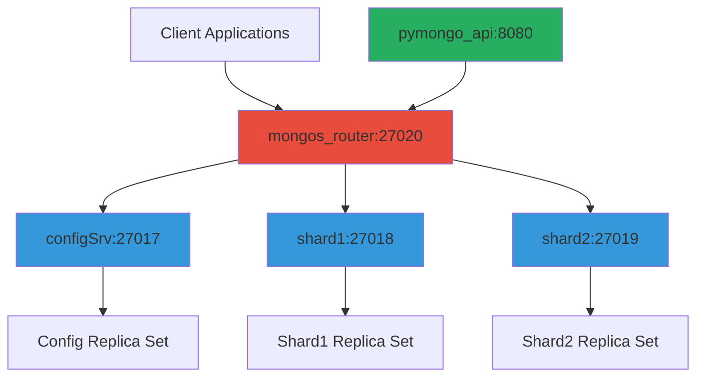
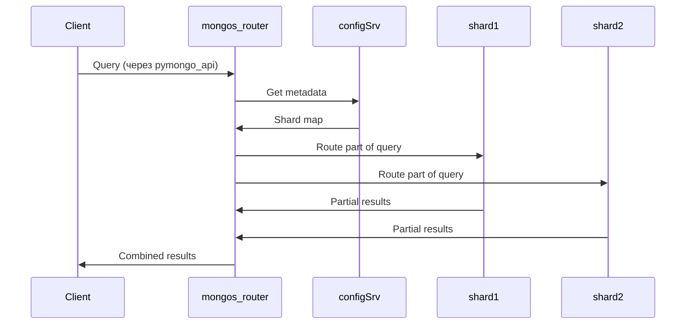

# Архитектура кластера

## Структура взаимодействий


## Порты и подключения

| Сервис | Внутренний порт | Внешний порт | Назначение |
|--------|-----------------|--------------|------------|
| **configSrv** | 27017 | 27017 | Config server |
| **shard1** | 27018 | 27018 | Данные шард 1 |
| **shard2** | 27019 | 27019 | Данные шард 2 |
| **mongos_router** | 27020 | 27020 | **Клиентские подключения** |
| **pymongo_api** | 8080 | 8080 | REST API |

## Процесс работы



# Настройка кластера

### 1. Запустите приложение

```shell
cd C:/h/a/f/software-architect-cource/labs/sprint-4/architecture-black_friday/mongo-sharding
docker compose up -d
```

### 2. Инициализируйте конфигурационный сервер

```shell
docker compose exec -T configSrv mongosh --port 27017 --quiet <<EOF
rs.initiate(
  {
    _id : "config_server",
       configsvr: true,
    members: [
      { _id : 0, host : "configSrv:27017" }
    ]
  }
);
EOF
```

### 3. Инициализируйте первый шард

```shell
docker compose exec -T shard1 mongosh --port 27018 --quiet <<EOF
rs.initiate(
    {
      _id : "shard1",
      members: [
        { _id : 0, host : "shard1:27018" }
      ]
    }
);
EOF
```

### 4. Инициализируйте второй шард

```shell
docker compose exec -T shard2 mongosh --port 27019 --quiet <<EOF
rs.initiate(
    {
      _id : "shard2",
      members: [       
        { _id : 1, host : "shard2:27019" }
      ]
    }
  );
EOF
```

### 5. Инициализируйте роутер

```shell
docker compose exec -T mongos_router mongosh --port 27020 --quiet <<EOF
sh.addShard("shard1/shard1:27018");
sh.addShard("shard2/shard2:27019");
sh.enableSharding("somedb");
sh.shardCollection("somedb.helloDoc", { "name" : "hashed" });
EOF
```

### 6. Наполните базу тестовыми данными

```shell
docker compose exec -T mongos_router mongosh --port 27020 --quiet <<EOF
use somedb
for(var i = 0; i < 1000; i++) db.helloDoc.insertOne({age:i, name:"ly"+i})
EOF
```

### 7. Выполните проверку результатов

1. Запросите общее количество документов в коллекции `helloDoc`.

```shell
docker compose exec -T mongos_router mongosh --port 27020 --quiet <<EOF
use somedb
db.helloDoc.countDocuments()
EOF
```

2. Запросите количество документов в коллекции `helloDoc` на первом шарде.

```shell
docker compose exec -T shard1 mongosh --port 27018 --quiet <<EOF
use somedb
db.helloDoc.countDocuments()
EOF
```

3. Запросите количество документов в коллекции `helloDoc` на втором шарде.

```shell
docker compose exec -T shard2 mongosh --port 27019 --quiet <<EOF
use somedb
db.helloDoc.countDocuments()
EOF
```

4. Получение количества документов
```shell
curl http://localhost:8080/helloDoc/count
```

