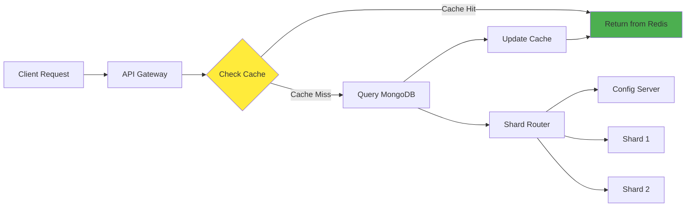

# Архитектура кластера

## Структура взаимодействий




## Таблица IP-адресации шардированного кластера с кэшем

| Сервис | Контейнер | Роль | IP-адрес | Порт | Назначение |
|--------|-----------|------|----------|------|------------|
| **Config Server** | `configSrv` | Metadata Store | `173.17.0.10` | 27017 | Хранение метаданных шардинга |
| **MongoS Router** | `mongos_router` | Query Router | `173.17.0.7` | 27020 | **Клиентские подключения** |
| **Redis Cache** | `cache` | In-Memory Cache | `173.17.0.40` | 6379 | Кэширование данных |
| **API Service** | `pymongo_api` | REST API | `173.17.0.50` | 8080 | HTTP API для клиентов |
| **Shard1 Primary** | `shard1_1` | Primary | `173.17.0.21` | 27021 | Основные данные шарда 1 |
| **Shard1 Secondary** | `shard1_2` | Secondary | `173.17.0.22` | 27022 | Реплика данных шарда 1 |
| **Shard1 Secondary** | `shard1_3` | Secondary | `173.17.0.23` | 27023 | Реплика данных шарда 1 |
| **Shard2 Primary** | `shard2_1` | Primary | `173.17.0.31` | 27031 | Основные данные шарда 2 |
| **Shard2 Secondary** | `shard2_2` | Secondary | `173.17.0.32` | 27032 | Реплика данных шарда 2 |
| **Shard2 Secondary** | `shard2_3` | Secondary | `173.17.0.33` | 27033 | Реплика данных шарда 2 |


# Настройка кластера
### 1. Запустите приложение

```shell
docker compose up -d
```

### 2. Инициализируйте конфигурационный сервер

```shell
docker compose exec -T configSrv mongosh --port 27017 --quiet <<EOF
rs.initiate(
  {
    _id : "config_server",
       configsvr: true,
    members: [
      { _id : 0, host : "configSrv:27017" }
    ]
  }
);
EOF
```

### 3. Инициализируйте первый шард и его реплики

```shell
docker compose exec -T shard1_1 mongosh --port 27021 --quiet <<EOF
rs.initiate(
    {
      _id : "shard1",
      members: [
        { _id : 0, host : "shard1_1:27021" },
        { _id : 1, host : "shard1_2:27022" },
        { _id : 2, host : "shard1_3:27023" }
      ]
    }
);
EOF
```

### 4. Инициализируйте второй шард и его реплики

```shell
docker compose exec -T shard2_1 mongosh --port 27031 --quiet <<EOF
rs.initiate(
    {
      _id : "shard2",
      members: [       
        { _id : 1, host : "shard2_1:27031" },
        { _id : 2, host : "shard2_2:27032" },
        { _id : 3, host : "shard2_3:27033" }
      ]
    }
  );
EOF
```

### 5. Инициализируйте роутер

```shell
docker compose exec -T mongos_router mongosh --port 27020 --quiet <<EOF
sh.addShard("shard1/shard1_1:27021");
sh.addShard("shard2/shard2_1:27031");
sh.enableSharding("somedb");
sh.shardCollection("somedb.helloDoc", { "name" : "hashed" });
EOF
```

### 6. Наполните базу тестовыми данными

```shell
docker compose exec -T mongos_router mongosh --port 27020 --quiet <<EOF
use somedb
for(var i = 0; i < 1000; i++) db.helloDoc.insertOne({age:i, name:"ly"+i})
EOF
```

### 7. Выполните проверку результатов

1. Запросите общее количество документов в коллекции `helloDoc`.

```shell
docker compose exec -T mongos_router mongosh --port 27020 --quiet <<EOF
use somedb
db.helloDoc.countDocuments()
EOF
```

2. Запросите количество документов в коллекции `helloDoc` на всех репликах первого шарда.

```shell
docker compose exec -T shard1_1 mongosh --port 27021 --quiet <<EOF
use somedb
db.helloDoc.countDocuments()
EOF
```

```shell
docker compose exec -T shard1_2 mongosh --port 27022 --quiet <<EOF
use somedb
db.helloDoc.countDocuments()
EOF
```

```shell
docker compose exec -T shard1_3 mongosh --port 27023 --quiet <<EOF
use somedb
db.helloDoc.countDocuments()
EOF
```

3. Запросите количество документов в коллекции `helloDoc` на втором шарде.

```shell
docker compose exec -T shard2_1 mongosh --port 27031 --quiet <<EOF
use somedb
db.helloDoc.countDocuments()
EOF
```

```shell
docker compose exec -T shard2_2 mongosh --port 27032 --quiet <<EOF
use somedb
db.helloDoc.countDocuments()
EOF
```

```shell
docker compose exec -T shard2_3 mongosh --port 27033 --quiet <<EOF
use somedb
db.helloDoc.countDocuments()
EOF
```

4. Получение количества документов
```shell
curl http://localhost:8080/helloDoc/count
```

5. Получение списка пользователей (кешируется на 60 секунд)
```shell
curl http://localhost:8080/helloDoc/users
```
